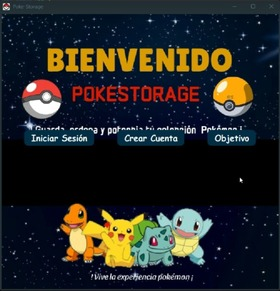

# **PokeStorage – Evaluación del Prototipo**

**Versión evaluada:** 0.6  
**Fecha de evaluación:** 2025-11-04  
**Equipo:** Grupo PokeStorage  
**Metodología:** Modelo Tradicional Basado en Prototipos  
**Repositorio:** [PokeStorage-Agiles](https://github.com/SebSar1/PokeStorage-Agiles)  
**Prototipo:** [🎨 Ver en Figma](https://www.figma.com/proto/NC9hzU04BwlzPl3x1dlIuO/POKESTORAGE)  

---

## **1. Objetivo de la Evaluación**

El propósito de esta evaluación es validar la funcionalidad y la usabilidad del prototipo de PokeStorage antes de su entrega final.  
Se busca comprobar que:
- Cumple con los requerimientos funcionales definidos en el SRD.
- La interfaz de usuario sigue las estructuras del prototipo en Figma.  
- El flujo de navegación y registro de Pokémon funciona correctamente.  
- Se identifican errores o mejoras para la siguiente iteración o versión final.

---

## **2. Tipos de Evaluación Realizados**

| Tipo de Evaluación | Descripción | Herramientas usadas |
|--------------------|-------------|----------------------|
| **Funcional** | Validación de operaciones principales del sistema (registro, navegación, árbol, historial). | Pruebas directas en la interfaz Swing. |
| **Usabilidad** | Evaluación visual del diseño, orden de botones, facilidad de uso. | Figma, pruebas entre usuarios. |
| **Técnica** | Revisión de la lógica implementada en las clases y estructuras. | Revisión de código (BusinessLogic, DataAccess).
---

## **3. Criterios de Evaluación**

| Criterio | Descripción | Nivel esperado |
|-----------|--------------|----------------|
| **Cumplimiento funcional** | Cada requerimiento definido esté implementado. | 100% |
| **Usabilidad del prototipo** | La interfaz sea clara, navegable y consistente con el Figma. | Alta |
| **Estabilidad del sistema** | Que no existan errores al realizar acciones básicas. | Sin errores críticos |

---

## **4. Resultados de la Evaluación**

| Elemento Evaluado | Resultado / Observación | Estado |
|--------------------|------------------------|--------|
| **Inicio de sesión** | El botón “Iniciar sesión” no permite avanzar al panel principal; el evento no está funcionando correctamente. | 🔴 No aprobado |
| **Panel principal** | La pantalla inicial no muestra correctamente los componentes según el diseño; falta alineación y elementos del menú. | 🟠 Requiere corrección |
| **Registro de Pokémon** | Funciona correctamente; los Pokémon se almacenan y se muestran en la lista circular. | 🟢 Aprobado |
| **Visualización del árbol AVL** | Los Pokémon se ordenan por poder; visualización funcional. | 🟢 Aprobado |
| **Historial de Pokémon** | Registro y lectura correcta de los datos almacenados. | 🟢 Aprobado |
| **Diseño visual (Figma)** | Coincide parcialmente con la interfaz desarrollada; algunos elementos del panel principal no están implementados. | 🟠 Parcial |
| **Documentación técnica** | Actualizada y disponible en GitHub; cumple con el formato. | 🟢 Aprobado |

---

## **4.1 Detalles Evaluación**

Durante la fase de evaluación del prototipo versión 0.6, se analizaron los módulos Panel Principal e Inicio de Sesión, debido a que presentaron inconsistencias en su funcionamiento y diseño visual respecto al prototipo definido en Figma.

### **Panel Principal**

**Descripción detallada:**
| Nº | Aspecto evaluado | Resultado esperado | Resultado observado | Nivel de impacto | Estado |
|----|------------------|--------------------|----------------------|------------------|--------|
| 1 | **Distribución visual** | Los botones, íconos y etiquetas deben mantenerse alineados y proporcionales según el prototipo en Figma. | Se observan componentes desalineados y posiciones que no coinciden con el diseño visual. | 🟠 Medio | ❌ No cumple |

**Observaciones generales:**
- El panel no refleja completamente el diseño del prototipo visual aprobado.
- Se recomienda ajustar el layout del `JPanel` principal para mantener las proporciones correctas y mejorar la visualización de los elementos.  

### **Inicio de sesión**
  
**Descripción detallada:**

| Nº | Aspecto evaluado | Resultado esperado | Resultado observado | Nivel de impacto | Estado |
|----|------------------|--------------------|----------------------|------------------|--------|
| 1 | **Funcionalidad del botón “Iniciar sesión”** | Al hacer clic, el sistema debe validar los campos e ingresar al panel principal. | El botón no responde y no permite avanzar a la siguiente interfaz. | 🔴 Alto | ❌ No cumple |

**Observaciones generales:**
- El módulo de inicio de sesión no cumple con la funcionalidad esperada, impidiendo el acceso al sistema.  

---

## **5. Conclusiones**

- El prototipo no se considera listo para aprobación final, ya que presenta fallos en la navegación inicial y en la estructura visual del panel principal.  
- El resto de módulos del sistema cumplen con los requerimientos definidos y pueden mantenerse sin cambios en la siguiente iteración.  
- Se recomienda una nueva versión del prototipo que implemente las correcciones necesarias antes de pasar a la fase de validación final.  
- El proceso de documentación y diseño técnico está correctamente alineado con la metodología utilizada.

**Versión evaluada:** 0.6  
**Estado del prototipo:** En evaluación  
**Requiere nueva iteración:** Sí  

---

## **6. Evidencias de Evaluación**

| Tipo | Evidencia | Enlace |
|------|------------|--------|
| 🎨 Prototipo visual | Capturas de pantalla y flujo validado en Figma. | [Ver en Figma](https://www.figma.com/proto/NC9hzU04BwlzPl3x1dlIuO/POKESTORAGE) |
| 📊 Control de versiones | Archivo `06_Versiones` actualizado. | [Ver documento](https://github.com/SebSar1/PokeStorage-Agiles/blob/docs/PokeStorage/docs/06_Versiones.md) |

---

## **7. Evaluador**

| Rol                   | Nombre            | Firma / Iniciales | Fecha       |
|-----------------------|-------------------|--------------------|-------------|
| **Tester / Usuario Evaluador**          | Sebastián Sarasti  | SS                 | 04/11/2025  |
---