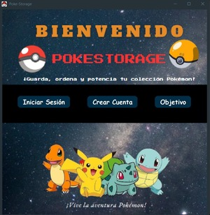
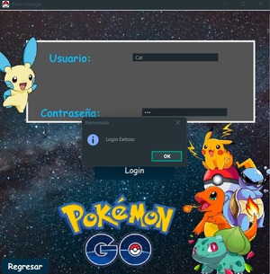

# **PokeStorage – Registro de Cambios**

**Versión del documento:** 1.0  
**Fecha de última actualización:** 2025-11-04  
**Proyecto:** PokeStorage  
**Metodología:** Modelo Tradicional Basado en Prototipos  
**Repositorio:** [PokeStorage-Agiles](https://github.com/SebSar1/PokeStorage-Agiles)

---

## **1. Objetivo del Documento**

Este documento tiene como propósito registrar de manera formal las modificaciones y mejoras implementadas en el sistema PokeStorage, como resultado de las observaciones obtenidas en la evaluación del prototipo versión 0.7.  
El registro permite mantener la trazabilidad de cambios y la evolución del sistema conforme al modelo tradicional basado en prototipos.

---

## **2. Control de Versiones**

| Versión | Fecha | Responsable | Descripción general |
|----------|--------|--------------|----------------------|
| **0.6** | 2025-11-04 | Equipo de desarrollo | Versión evaluada con fallos en el inicio de sesión y estructura visual del panel principal. |
| **1.0** | 2025-11-04 | Equipo de desarrollo | Versión final validada y lista para entrega. |

---

## **3. Cambios Realizados**

| Nº | Fecha | Versión | Módulo / Componente | Descripción del cambio | Responsable | Estado |
|----|--------|----------|---------------------|-------------------------|--------------|--------|
| 1 | 2025-11-04 | 1.0 | **Panel Principal (interfaz gráfica)** | Se redimensionaron las imágenes y componentes visuales del panel principal para mejorar la alineación, escala y proporción visual respecto al diseño en Figma. | Samira Arízaga | Implementado |
| 2 | 2025-11-04 | 1.0 | **Clase `IniciarSesionPanel` (módulo de inicio de sesión)** | Se ajustó el evento del botón “Iniciar sesión” dentro de la clase `IniciarSesionPanel`. Ahora ejecuta correctamente el método que valida las credenciales y carga el panel principal. | Sebastián Saritama | Implementado |

---

## **4. Resultados tras los cambios**

| Criterio evaluado | Resultado posterior a la corrección | Estado |
|--------------------|--------------------------------------|--------|
| **Evento del botón “Iniciar sesión”** | El evento fue corregido dentro de `IniciarSesionPanel` y ahora redirige al panel principal sin errores. | 🟢 Aprobado |
| **Diseño del panel principal** | La interfaz muestra todos los elementos visuales correctamente alineados y con dimensiones ajustadas. | 🟢 Aprobado |
| **Flujo de navegación** | El sistema permite iniciar sesión y acceder al panel principal conforme al diseño funcional. | 🟢 Aprobado |

---

## **4.1 Evidencias gráficas de mejoras**

A continuación se presentan las capturas que evidencian las correcciones aplicadas al panel principal y al inicio de sesión:

- **Modificación 1: Panel Principal (interfaz ajustada y redimensionada)**  

**Descripción:**  
El panel principal fue ajustado en tamaño y estructura. Las imágenes y componentes se redimensionaron correctamente para mantener coherencia con el diseño en Figma.

---

- **Modificación 2: Inicio de Sesión (botón funcional)** 

**Descripción:**  
Se modificó el evento del botón “Iniciar sesión” en la clase `IniciarSesionPanel`. Ahora la acción valida los campos y permite ingresar correctamente al panel principal.

---
## **5. Observaciones generales**

- Las correcciones aplicadas resuelven los fallos detectados en la evaluación del prototipo v0.6  
- Se mejoró la coherencia visual y la navegabilidad del sistema.  
- Las pruebas posteriores confirmaron el funcionamiento correcto del flujo principal y la adecuación visual con el prototipo en Figma.  
- Se considera que el sistema alcanza la versión estable (v1.0), lista para documentación final y presentación.

---

## **6. Firma de Aprobación**

| Rol | Nombre | Firma / Iniciales | Fecha |
|------|---------|--------------------|--------|
| **Desarrollador principal** | Danna Morales| DM | 04/11/2025 |
| **Tester / Usuario Evaluador** | Sebastian Sarasti | SS | 04/11/2025 |

---

**Estado actual del sistema:**  
**Versión 1.0** – Validada y aprobada
